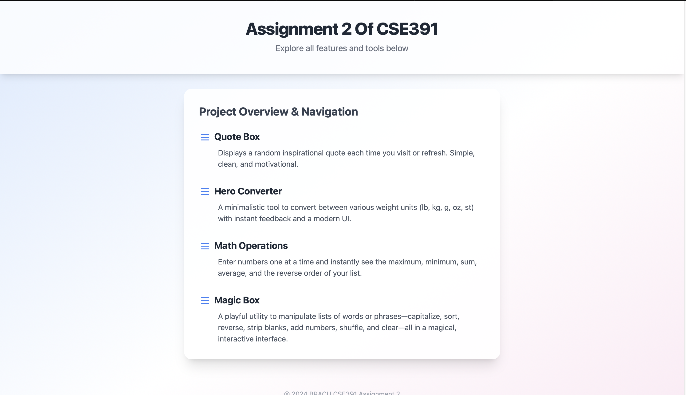
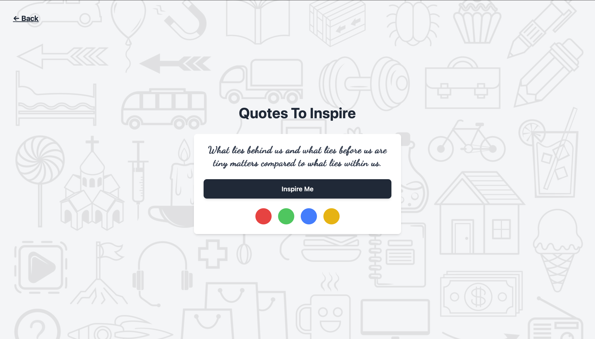
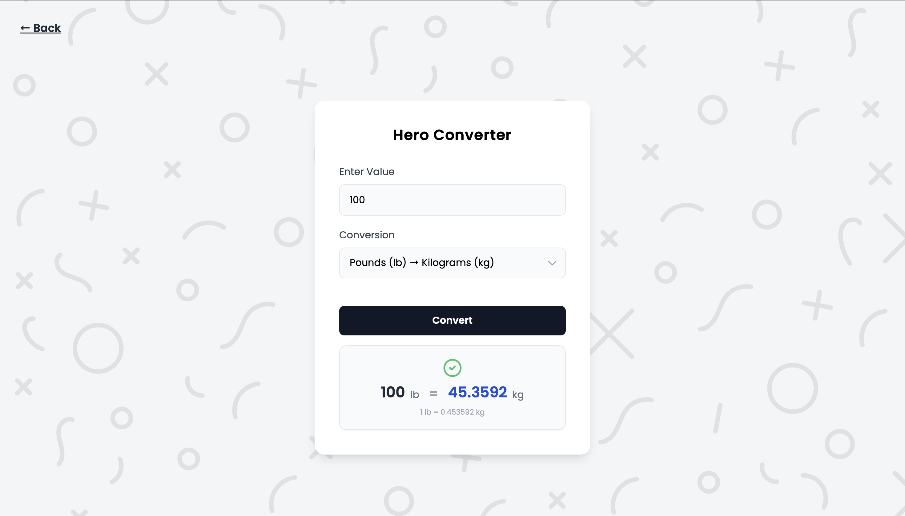
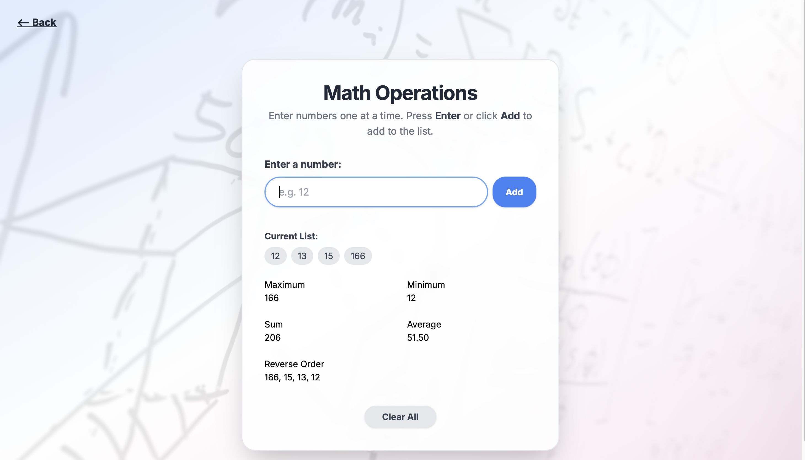
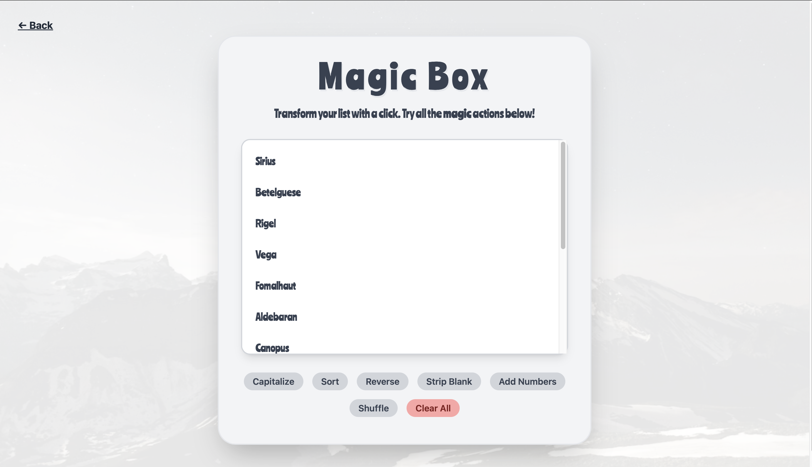

# CSE391 Assignment 2 – JavaScript Projects

Welcome to the CSE391 Assignment 2 repository!  
This project contains a set of interactive, modern JavaScript mini-apps built with a focus on clean UI, usability, and best practices.  
Each tool is accessible from the main navigation page and is fully responsive.

---

## 🌟 Project Showcase

### 1. Quote Box

A simple, elegant app that displays a random inspirational quote.  
You can change the quote and customize the color for a personalized experience.

**Screenshot:**

<!-- Upload your screenshot here -->



---

### 2. Hero Converter

A minimalistic weight converter supporting pounds, kilograms, grams, ounces, and stones.  
Features a clean UI, instant feedback, and a visually appealing result card.

**Screenshot:**

<!-- Upload your screenshot here -->



---

### 3. Math Operations

Enter numbers one at a time to see the maximum, minimum, sum, average, and reverse order of your list.  
The interface is intuitive, with a pill-shaped input and a live-updating result display.

**Screenshot:**

<!-- Upload your screenshot here -->



---

### 4. Magic Box

A playful utility for manipulating lists of words or phrases.  
Features include: capitalize, sort, reverse, strip blanks, add numbers, shuffle, and clear—all in a magical, interactive interface.

**Screenshot:**

<!-- Upload your screenshot here -->



---

## 🚀 Getting Started

1. **Clone the repository:**
   ```sh
   git clone https://github.com/yourusername/cse391-JS-Assignment.git
   ```
2. **Open `index.html` in your browser**  
   All projects are accessible from the main navigation page.

---

## 📂 Project Structure

```
cse391-JS-Assignment/
│
├── index.html                # Main navigation & overview
├── README.md                 # This file
│
├── quoteBox/
│   └── quoteBox.html         # Quote Box app
│
├── heroConverter/
│   └── hero.html             # Hero Converter app
│
├── BasicMathOperations/
│   └── operations.html       # Math Operations app
│
├── magicBox/
│   └── magicbox.html         # Magic Box app
│
└── screenshots/
    ├── quote-box.png
    ├── hero-converter.png
    ├── math-operations.png
    └── magic-box.png
```

---

## ✨ Features

- **Modern, responsive UI** with Tailwind CSS and custom styles.
- **Breadcrumb navigation** for easy access back to the main page.
- **Background images** and subtle gradients for visual appeal.
- **Live feedback** and error handling for all user inputs.
- **Accessible and mobile-friendly** design.

---

## 📝 License

This project is for educational purposes as part of BRACU CSE391.

---
